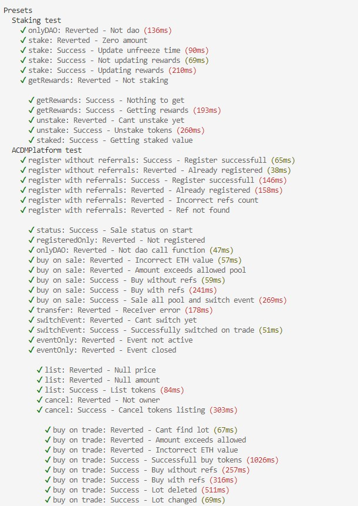
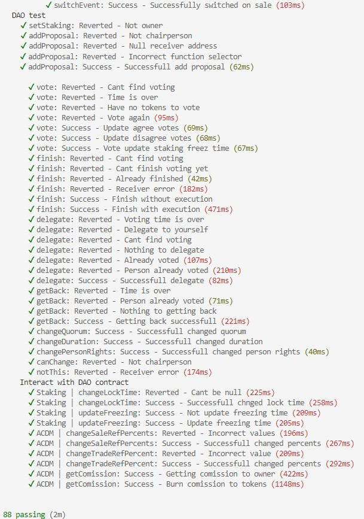
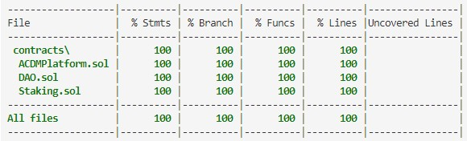

  
  
  

Созданы токены:  
* XXXToken [0x82201CF046391b5eF764749AD2f992eaD6857191](https://rinkeby.etherscan.io/address/0x82201CF046391b5eF764749AD2f992eaD6857191)  
* ACDMToken [0x3A6FBf1C4E939Adb744c8767c9f1A647886afa3C](https://rinkeby.etherscan.io/token/0x3A6FBf1C4E939Adb744c8767c9f1A647886afa3C)  
 

Написан, развернут и верифицирован DAO контракт по адресу [0xA16e58f9cCbf8FD75FCF97FB69eEcB49DA2b55e1](https://rinkeby.etherscan.io/address/0xA16e58f9cCbf8FD75FCF97FB69eEcB49DA2b55e1).  

Написан, развернут и верифицирован контракт Staking по адресу [0x0172E8F8A2038e7cf99A4ff468410638958e0578](https://rinkeby.etherscan.io/address/0x0172E8F8A2038e7cf99A4ff468410638958e0578).  

Написан, развернут и верифицирован котракт биржи ACDMPlatform по адресу [0x9683D201a1a30A995F4cDDe3d2c2651082c94594](https://rinkeby.etherscan.io/address/0x9683D201a1a30A995F4cDDe3d2c2651082c94594).  

Написаны hardhat task`и, для взаимодействия с контрактами.  
Кроме того, была реализована небольшая имитация бэка для возможности удобной покупки токенов на бирже в трейд раунде.  
/"Бэк/" был реализован посредством использования базы данных Postgre, в которой хранится и обновляется посредством отслеживания событий информация о размещенных ордерах пользователей.  
Таким образом, можно не искать самую низкую цену самостоятельно, а это будет реализовано написанной программой, которая купит необходимое количество позиций по заданной цене.